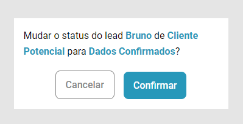

# Processo seletivo - JusCash

#### Lucas Ramos Lamonier

### Aplicação disponível em [https://lrlamonier.github.io/juscash/](https://lrlamonier.github.io/juscash/)

| [lucasrlamonier@gmail.com](mailto:lucasrlamonier@gmail.com) | [LucasLamonier.com/](https://www.lucaslamonier.com/) |
| ---- | ----- |
[GitHub.com/LrLamonier](https://github.com/LrLamonier/) | [LinkedIn.com/in/Lamonier/](https://www.linkedin.com/in/lamonier/) |
| [WhatsApp: (62) 98164-4181](https://wa.me/5562981644181)

### Sumário

- [1 - Otimização de SEO](#1---otimização-de-seo)
- [2 - Quickstart](#2---quickstart)
- [3 - Considerações gerais](#3---considerações-gerais)
    - [3.1 - Back end](#31---back-end)
    - [3.2 - Validação dos formulários](#32---validação-dos-formulários)
    - [3.3 - Autenticação](#33---autenticação)
    - [3.4 - Funcionalidades](#34---funcionalidades)

---

#### 1 - Otimização de SEO

Com o objetivo de impulsionar a presença online da aplicação nos mecanismos de busca, utilizei, além das tags meta no `<head>`, tags específicas do [Open Graph Protocol](https://ogp.me/) e de geração de [cards do Twitter](https://developer.twitter.com/en/docs/twitter-for-websites/cards/overview/markup). Essas tags permitem que informações personalizadas sobre a página sejam exibidas quando o link é compartilhado. As imagens abaixo são prévias de como o link aparece quando compartilhado em diversas redes sociais. As tags podem ser verificadas também na [plataforma de desenvolvedores da Meta](https://developers.facebook.com/tools/debug/) e em sites como [OpenGraph](https://www.opengraph.xyz/) e [Rakko](https://en.rakko.tools/tools/9/).

| Rede social | Screenshot do card |
| --- | --- |
| WhatsApp |  |
| Instagram |  |
| Facebook (desktop / mobile) |  |
| Twitter (à esquerda, as duas variações possíveis em desktop, à direita as variações para mobile) |  | 
|LinkedIn |  |
| Discord |  |

---

### 2 - Quickstart

Este projeto foi desenvolvido com React, TypeScript e [Vite](https://vitejs.dev/). Para rodar o projeto localmente:

1. [Clone](https://docs.github.com/pt/repositories/creating-and-managing-repositories/cloning-a-repository) o repositório ou faça o download dos arquivos.
2. Em um terminal na pasta raiz do projeto e com [Node e NPM](https://docs.npmjs.com/downloading-and-installing-node-js-and-npm) instalados, execute `npm install`.
3. Ao final da instalação, execute `npm run dev`.
4. Verifique no console em qual porta do `localhost` a aplicação está disponível. Por padrão é `http://localhost:5173`.
5. Para gerar uma build para produção, execute `npm run build`.

---

### 3 - Considerações gerais

#### 3.1 - Back end

Nas orientações do teste constam apenas as telas de criação de conta, dos leads do usuário e o modal de criação/exibição de lead. Utilizando o `localstorage` como "back end", implementei também a funcionalidade de login e persistência dos leads por usuário.

Para isso, criei funções básicas que simulam o comportamento de um back end e estabelecendo uma camada entre a aplicação e o `localstorage`/banco de dados.

#### 3.2 - Validação dos formulários

Para garantir uma experiência de usuário eficaz, os campos dos formulários são validados individualmente. Os campos com erro ficam destacados e o usuário é notificado sobre o que aconteceu. Ao tentar criar uma conta com um email já cadastrado, por exemplo, o erro especifica que o email já está em uso.

Outra característica importante é que, ao interagir com um campo marcado como erro, a marcação desaparece, reforçando para o usuário que foi feita uma alteração. Tal situação pode ser observada nas imagens a seguir.

#### 3.3 - Autenticação

Cada lead possui uma id única e o email de qual usuário o criou. Desta forma, ao fazer login com usuários diferentes, apenas os respectivos leads serão exibidos.

#### 3.4 - Funcionalidades

A funcionalidade de arrastar e soltas os leads foi implementado de uma forma que deixa claro para o usuário onde é possível soltar. Isso foi feito de forma a facilitar a operação da aplicação.

Quando o usuário solta o lead no slot disponível, aparece um modal de confirmação que exibe o nome, status atual e o status seguinte.

---

[Voltar para o topo](#processo-seletivo---juscash)